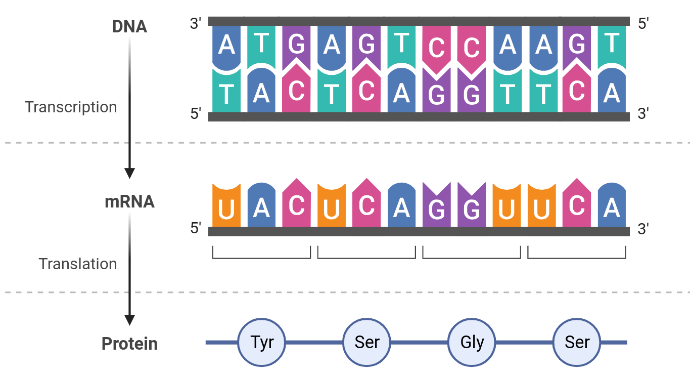
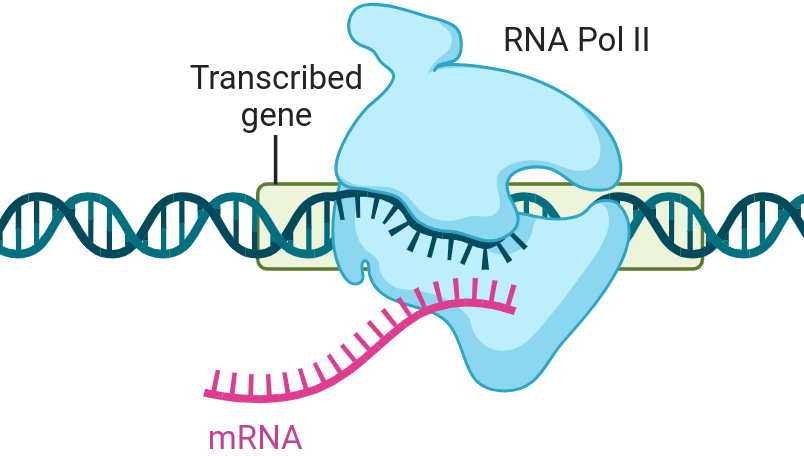
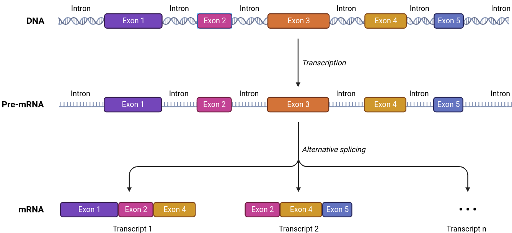
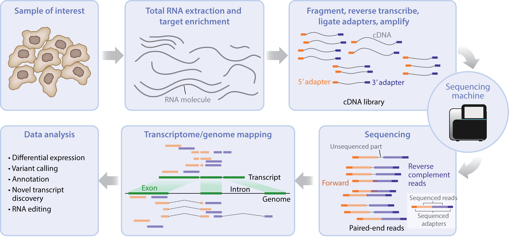
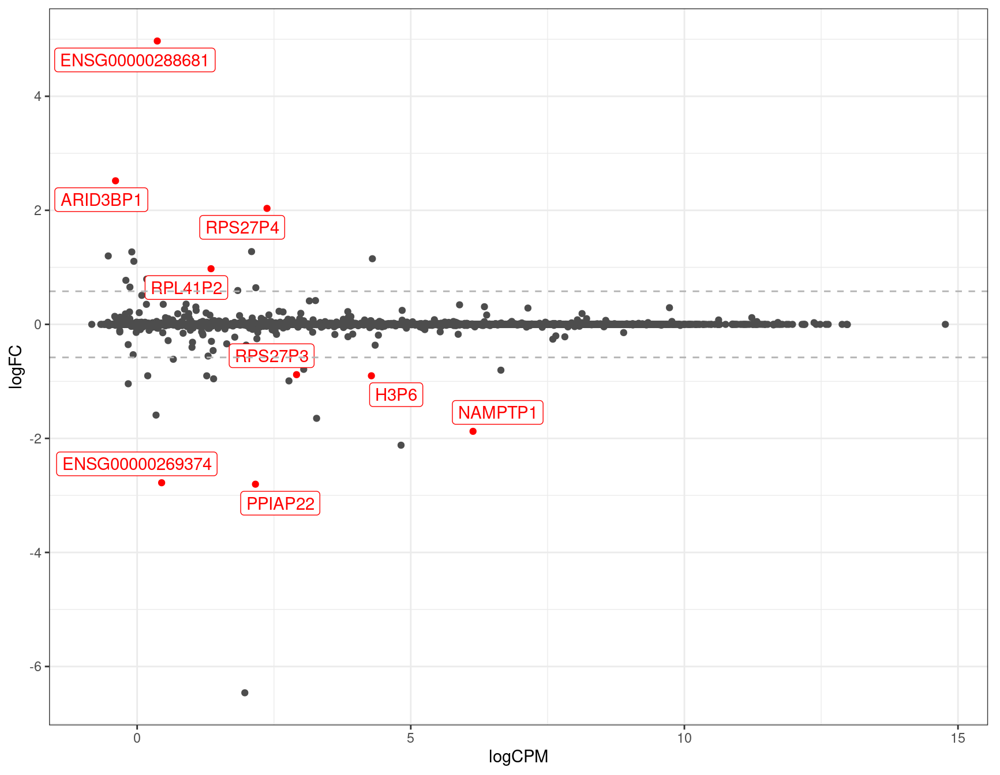
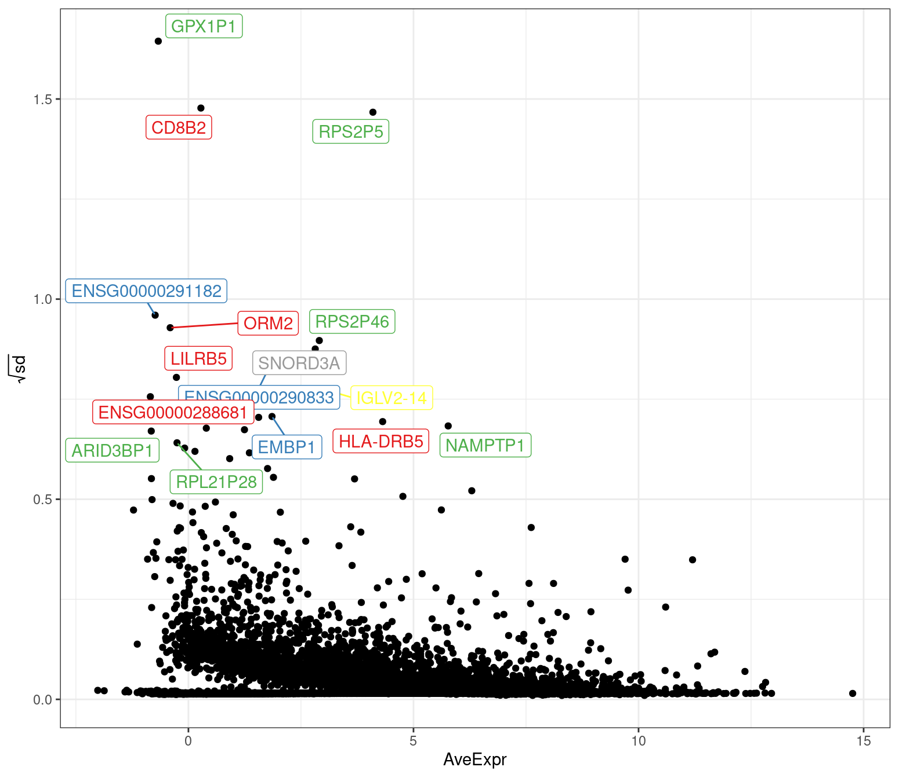

```{r, echo=FALSE}
knitr::opts_chunk$set(
  fig.align = "center"
)
```


# What Is A Transcriptome?

## The Central Dogma of Biology

Every person has their own unique *DNA*, contained in the nucleus of every cell, commonly known as their *genome*.
The genome is like a great book of instructions telling our body how to do everything required for life.
Whilst DNA is static and stays in the nucleus, the majority of dynamic and active molecules in our body are *proteins*, and these are found in every part of every cell, and even outside cells.
Proteins form well-known molecules like the keratin in your hair, haemoglobin in your blood and thousands of others, functioning as molecular machines enabling every biological function.

*How do we get from DNA to Proteins?*
The answer is *RNA* (Figure \@ref(fig:fig1))

```{r fig1, echo=FALSE, out.width='40%', fig.show='hold', fig.cap = "*(Left) The Central Dogma of Biology DNA $\\implies$ RNA $\\implies$ Protein. (Right) Representation of DNA being transcribed into RNA. Taken from app.biorender.com*"}


```


DNA contains ~60,000 regions identified as *genes* and each is *transcribed* into a molecule known as *RNA* (Figure \@ref(fig:fig1)).
Whilst DNA is a set of double-stranded, highly-stable, extremely long molecules within a cell's nucleus, RNA molecules are shorter, transient, single-stranded molecules.
Each cell-type only transcribes a subset of genes and this can often change rapidly in response to factors such as a viral infection.

## The Transcriptome

The many thousands of transcribed RNA molecules found in a set of cells is commonly referred to as a *transcriptome*.
As transcriptomes are highly dynamic, they **can contain signatures of inflammation or disease.**
Whilst proteins are the molecular machines responsible for our bodies function, analysing the complete set of proteins within a set of cells (i.e. a *proteome*) is not viable.
Hence, we analyse transcriptomes to gain insight into what is happening at the protein level, and to see what changes are occurring at this highly-dynamic, intermediate stage.

## The Complexity of RNA Molecules

Whilst transcribed from a discrete set of genes as a single RNA molecule, in order to form the mature transcript ready for translation into a protein, sections of the RNA, known is *introns* are spliced out, leaving regions behind known as *exons*.
Most genes can have their exons joined together in multiple version, known as *isoforms* and these add a layer of complexity, with multiple transcript versions being able to be produced from a single gene (Figure \@ref(fig:fig2)).
As a result, the ~60,000 genes are capable of producing >250,000 different transcripts.

```{r fig2, echo=FALSE, out.width='75%', fig.cap = "*Alternate transcripts are able to be formed from different combinations of exons. Taken from app.biorender.com*"}

```


# How Do We Analyse a Transcriptome?

```{r fig3, echo=FALSE, out.width='70%', fig.cap = "*Complete summary of transcriptome analysis, taken from [@berge2019]*"}

```


RNA taken from a sample contains molecules from all cells within the sample, representing many millions of transcripts of varying lengths.
These RNA molecules are fragmented into ~200-300nt molecules then prepared for *RNA sequencing*  (Figure \@ref(fig:fig3)).
After sequencing, these fragments are aligned to a *reference genome*.
Reads aligning within an exon are counted and the number of reads aligning to exons within a gene are taken as a measure of a gene's transcriptional activity.
Changes in abundance which track with a disease state or experimental treatment are then found.

An alternative is to align reads to a *reference transcriptome* providing estimates of abundance at the *transcript* level.
This adds another layer of uncertainty but also provides key information, as different transcripts produce different proteins with different functions.


# What Are Variants

Each person has millions of positions within the genome which are different from other people.
These are key contributors to what make us unique as people, playing a role in eye colour, height etc.

The reference genome contains only *one possible nucleotide* at each position.
Any difference between an individual and the reference genome is considered to be a *variant*.
The huge number of variants within individuals and across populations, this makes aligning sequencing reads to the genome difficult as they can influence where a read aligns.

# Testing A Modified Reference

1,846,512 variants were selected from the 1000 Genomes Project (1000GP).
78,124 of these overlapped an exon leading to possible changes in the sequence of 82,557 transcripts from 24,972 genes.
This can have a non-trivial impact on where each read aligns and which transcript it is assigned to.
An alternate genome reference was created incorporating these variants and 6 samples from the PROPHECY transcriptomics layer were aligned to both the standard reference and the modified reference.
Analysis at the gene-level showed significant changes in gene expression estimates based on which reference was used.

```{r, echo=FALSE, out.width = c('45%', '41%'), fig.show='hold', fig.cap = "*(Left) Changes in gene expression estimates for PROPHECY samples based on the 1000GP-modified reference. (Right) Genes showing increased variability as a results of using a modified reference.*"}


```


# Future Directions

The PROPHECY Study contains a transcriptomics layer, with samples taken from from the blood of participants, in order to shed light on Type 2 Diabetes and complications such as cardiovascular disease and chronic kidney disease within Indigenous Australians.
The unique genetic diversity of Aboriginal people is poorly represented in the standard reference genome and also amongst public repositories of variation such as the 1000 Genomes Project.
As this diversity is suspected to be a potential driver of disease risk and progression through to serious complications, choosing an approach to this study which is includes this unique aspect is very important.

A modified reference genome and the accompanying transcriptome is being produced which incorporates diversity identified during analysis of the genomic layer of this study.
It is anticipated that this will provide more accurate results, and allow any genetic influences unique to Indigenous Australians to become visible.
This is in turn aiming to lead to pathways for clinical intervention and improved health outcomes.

Whilst a modified reference genome is able to be produced simply to enable improved analysis at the gene-level.
Creation of a modified reference transcriptome will also be undertaken as this will yield additional information at the *transcript* level.

# References

